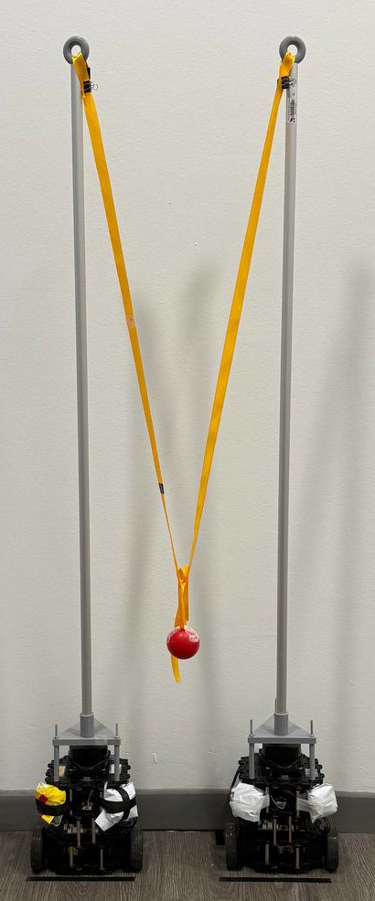

# Multi-Robot Cooperative Transport with Tethered TurtleBot3 (ROS 2 Jazzy)

## Overview

This repository contains the implementation of adaptive formation control and navigation for multi-robot tethered cooperative transport.

The work is built on top of the official TurtleBot3 ROS 2 ecosystem and extends it with custom modifications for multi-robot coordination, obstacle-aware navigation, and cooperative transport using two TurtleBot3 Burger robots coupled by a flexible tether.

The project focuses on coordinated motion in cluttered indoor environments, with particular attention to formation control, navigation integration, and management of physical coupling constraints.

> Based on the official [ROBOTIS TurtleBot3](https://github.com/ROBOTIS-GIT/turtlebot3) ROS 2 packages.

---

## Repository Scope

This repository is based on the official TurtleBot3 ROS 2 packages and includes custom extensions and modifications developed for the thesis project.

The original TurtleBot3 stack is used as the experimental and software foundation, while the main contributions of this work focus on multi-robot coordination, adaptive formation control, customized navigation behavior, and cooperative transport using tethered robots.

Only the files listed in the "Modified Files" section represent original contributions of this work.

---

## Main Contributions

- Development of a multi-robot system based on two TurtleBot3 Burger platforms  
- Implementation of adaptive formation control strategies  
- Integration of cooperative transport using a flexible tether between robots  
- Custom configuration of the ROS 2 Nav2 stack for multi-robot navigation  
- Obstacle-aware navigation with formation adaptation  
- Implementation of a virtual frame-based coordination strategy  
- Custom launch files and system configuration for multi-robot deployment  

---

## Cooperative Transport Mechanism

The transport system is based on two TurtleBot3 robots physically connected by a flexible tether, with the payload attached at the midpoint of the cable.

This setup introduces mechanical coupling between the robots, requiring coordinated motion to ensure stable transport.

Key aspects of the system include:

- Force transmission through the tether, affecting robot dynamics  
- Constraints on relative motion between robots  
- Coupled navigation behavior during obstacle avoidance  
- Centralized coordination to maintain formation while transporting the payload  

The control strategy accounts for these constraints by adapting formation geometry and robot velocities in real time.


<p align="center">
  
</p>

---

## Modified Files

The following files were modified or added with respect to the official TurtleBot3 repository:

### Modified

| File | Description |
|------|-------------|
| `turtlebot3/CMakeLists.txt` | Updated build configuration |
| `turtlebot3_cartographer/config/turtlebot3_lds_2d.lua` | Custom LiDAR configuration for experimental scenarios |
| `turtlebot3_cartographer/launch/cartographer.launch.py` | Adapted SLAM launch for multi-robot setup |
| `turtlebot3_navigation2/launch/navigation2.launch.py` | Multi-robot navigation launch with namespace support |
| `turtlebot3_navigation2/param/burger.yaml` | Tuned Nav2 parameters for cooperative transport |
| `turtlebot3_navigation2/rviz/tb3_navigation2.rviz` | Custom RViz layout for multi-robot visualization |

### Added

| File | Description |
|------|-------------|
| `turtlebot3_navigation2/param/burger_3.yaml` | Nav2 parameters for the second robot |
| `turtlebot3_navigation2/map/map_free.*` | Map of open environment |
| `turtlebot3_navigation2/map/map_room.*` | Map of room environment |
| `turtlebot3_navigation2/map/mappa_buona.*` | Final experimental map |
| `turtlebot3_navigation2/scripts/formation_controller_speed.py` | Speed-based formation controller |
| `turtlebot3_navigation2/scripts/formation_follower.py` | Follower-based cooperative transport controller|
| `turtlebot3_navigation2/scripts/virtual_center.py` | Virtual frame center computation |
| `turtlebot3_navigation2/scripts/tf_aggregator.py` | TF frame aggregation for multi-robot coordination |
| `turtlebot3_navigation2/scripts/robot_pose_reader.py` | Robot pose reading utility |
| `turtlebot3_navigation2/scripts/follow_point_tb3_3.xml` | Behavior tree for follower robot |

---

## Requirements

- ROS 2 Jazzy  
- TurtleBot3 packages  
- Nav2 stack  
- Cartographer ROS  

---

## How to Run

All commands are intended to be executed in separate terminals after building the workspace and sourcing the environment:

```bash
# =========================================================
# 1. Build the workspace
# =========================================================
cd <your_ws>
colcon build
source install/setup.bash

# =========================================================
# 2. SLAM (optional - for mapping)
# =========================================================
# Terminal 1
ros2 launch turtlebot3_cartographer cartographer.launch.py \
  namespace:=<robot_1_ns>

# =========================================================
# 3. Robot Bringup (for each robot)
# =========================================================
# Terminal 2 - Robot 1
ros2 launch turtlebot3_bringup robot.launch.py \
  namespace:=<robot_1_ns>

# Terminal 3 - Robot 2
ros2 launch turtlebot3_bringup robot.launch.py \
  namespace:=<robot_2_ns>

# =========================================================
# 4. Navigation2 (for each robot)
# =========================================================
# Terminal 4 - Robot 1
ros2 launch turtlebot3_navigation2 navigation2.launch.py \
  namespace:=<robot_1_ns> \
  map:=<your_ws>/src/turtlebot3/turtlebot3_navigation2/map/<your_map>.yaml \
  params_file:=<your_ws>/src/turtlebot3/turtlebot3_navigation2/param/burger_3.yaml \
  use_sim_time:=false

# Terminal 5 - Robot 2
ros2 launch turtlebot3_navigation2 navigation2.launch.py \
  namespace:=<robot_2_ns> \
  map:=<your_ws>/src/turtlebot3/turtlebot3_navigation2/map/<your_map>.yaml \
  params_file:=<your_ws>/src/turtlebot3/turtlebot3_navigation2/param/burger.yaml \
  use_sim_time:=false

# =========================================================
# 5. Formation Control & Cooperative Transport
# =========================================================
# Terminal 6 - TF aggregation
python3 <your_ws>/src/turtlebot3/turtlebot3_navigation2/scripts/tf_aggregator.py

# Terminal 7 - Virtual center computation
python3 <your_ws>/src/turtlebot3/turtlebot3_navigation2/scripts/virtual_center.py

# Terminal 8 - Teleoperation of the virtual frame
ros2 run teleop_twist_keyboard teleop_twist_keyboard \
  --ros-args -r cmd_vel:=/formation/cmd_vel

# Terminal 9 - Formation controller
python3 <your_ws>/src/turtlebot3/turtlebot3_navigation2/scripts/formation_controller_speed.py

# Terminal 10 - Follower robot 1
python3 <your_ws>/src/turtlebot3/turtlebot3_navigation2/scripts/formation_follower.py \
  --ros-args \
  -p robot_ns:=<robot_1_ns> \
  -p bt_xml_path:=<your_ws>/src/turtlebot3/turtlebot3_navigation2/scripts/follow_point_tb3_3.xml

# Terminal 11 - Follower robot 2
python3 <your_ws>/src/turtlebot3/turtlebot3_navigation2/scripts/formation_follower.py \
  --ros-args \
  -p robot_ns:=<robot_2_ns> \
  -p side_sign:=1.0 \
  -p bt_xml_path:=<your_ws>/src/turtlebot3/turtlebot3_navigation2/scripts/follow_point_tb3_3.xml
